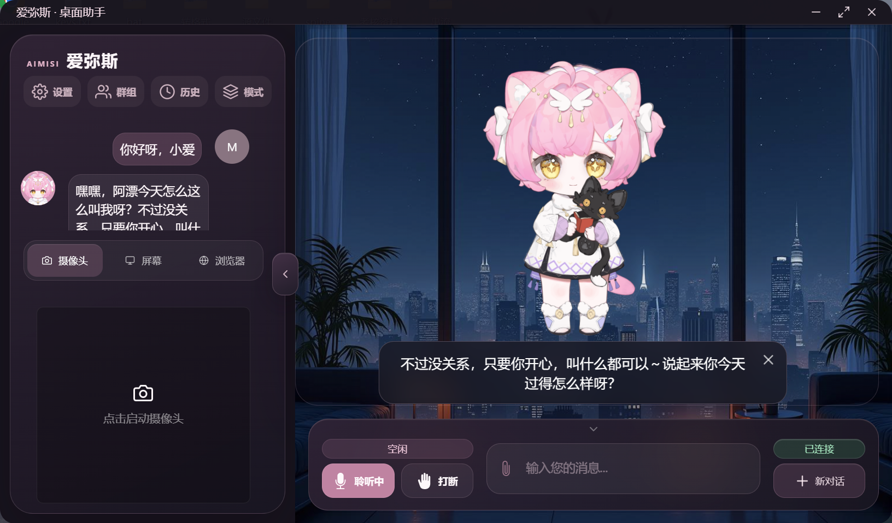
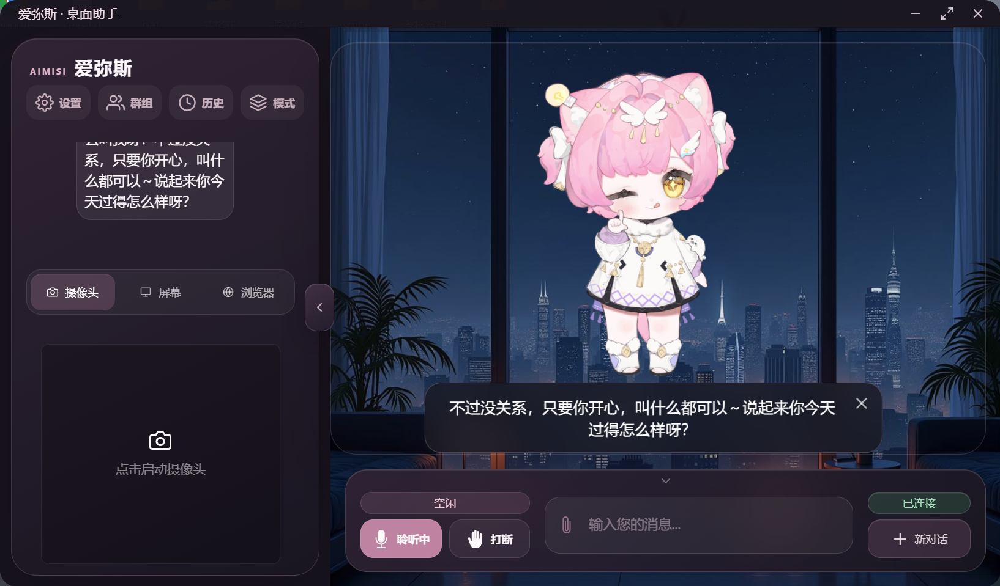
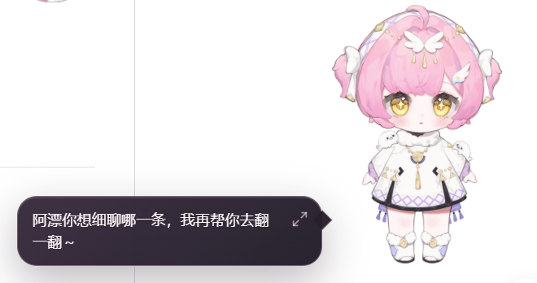
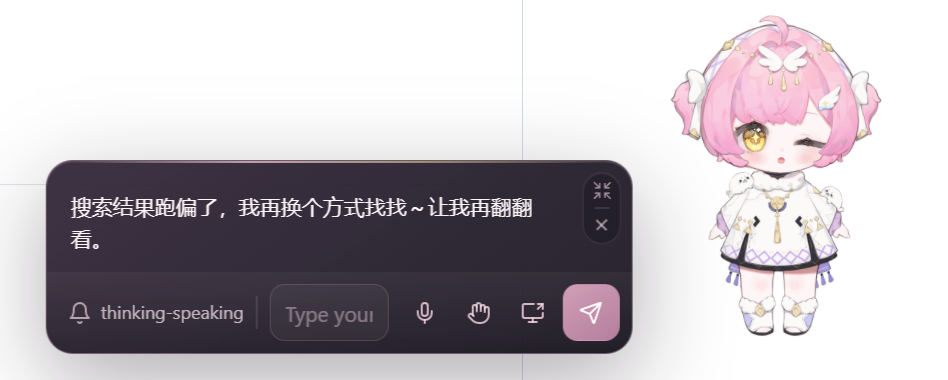

# 爱弥斯桌面助手（Aemeath Assistant）

爱弥斯桌面助手是一款带有 Live2D 角色的 Windows AI 桌面助手。你可以通过文字或语音与爱弥斯实时对话交流，也可以把她作为桌宠放在桌面上陪伴和互动。

## 界面展示

| 窗口模式 | 表情与动作 |
|---|---|
|  |  |

| 桌宠对话 | 桌宠输入框 |
|---|---|
|  |  |

## 可以实现什么

- 通过文字或语音与爱弥斯实时对话
- 使用 Live2D 展示语音、表情、动作和口型
- 包含窗口模式与桌宠模式
- 通过点击、拖动和缩放等操作与角色互动
- 支持视频或屏幕共享
- 保存对话和常用设置，并支持联网搜索

## 如何使用

### 1. 安装

运行项目发布的 Windows 安装程序，按照安装向导完成安装。

覆盖安装新版本前，请先完全退出爱弥斯桌面助手，包括系统托盘中的后台程序。

### 2. 启动

安装完成后，通过桌面快捷方式或开始菜单启动爱弥斯桌面助手。

应用会自动启动所需的本地服务。首次启动可能需要等待一段时间，请在显示连接成功后开始使用。

### 3. 配置对话和语音

打开软件设置，在模型设置和语音设置中填写自己可用的服务配置并保存。

密钥仅用于连接你选择的服务，请勿截图、上传或分享包含密钥的配置文件和日志。

### 4. 开始对话

- 在底部输入框中输入内容并发送，即可进行文字对话。
- 打开麦克风后，可以直接与爱弥斯实时语音对话。
- 爱弥斯回复时会播放语音，并根据内容展示对应的表情和动作。
- 需要立即停止当前回复时，可以使用中断按钮。
- 使用“新对话”可以结束当前上下文并开始新的会话。
- 打开摄像头或屏幕分享，爱弥斯可以看到你屏幕上的内容(此功能需要使用带图片识别功能的模型)。

### 5. 使用桌宠模式

通过界面菜单、系统托盘菜单或角色右键菜单切换到桌宠模式。

在桌宠模式下可以：

- 拖动爱弥斯到合适的位置
- 使用鼠标滚轮调整角色大小
- 点击角色不同区域触发动作
- 显示或隐藏对话框
- 开启鼠标穿透，避免角色遮挡其他窗口

### 6. 系统托盘

点击关闭按钮后，软件默认隐藏到系统托盘，不会立即退出。

需要彻底关闭程序时，请打开系统托盘菜单并选择退出。

## 使用提示

- 麦克风已打开但无法识别时，请检查 Windows 麦克风权限和当前输入设备。
- 没有语音但能看到字幕时，请检查语音服务配置以及系统音频环境。
- 无法联网获取信息时，请检查网络连接和联网功能配置。
- 更新或覆盖安装后，建议检查角色、窗口和语音设置是否正确恢复。
- 请勿公开分享包含个人密钥、聊天记录或调试日志的文件。

## 致谢与素材说明

本项目基于 [Open-LLM-VTuber](https://github.com/Open-LLM-VTuber/Open-LLM-VTuber) 进行二次开发。

爱弥斯 Live2D 模型素材来源于 B 站创作者 **木果阿木果**（木果制作），角色设计版权归属于库洛。

相关角色与模型素材仅限非商业用途，不得二次上传、转载或用于引流。使用相关素材制作鸣潮视频或直播内容时，请按素材作者要求标注来源。代码与第三方素材分别适用其各自的许可证和使用条款。
